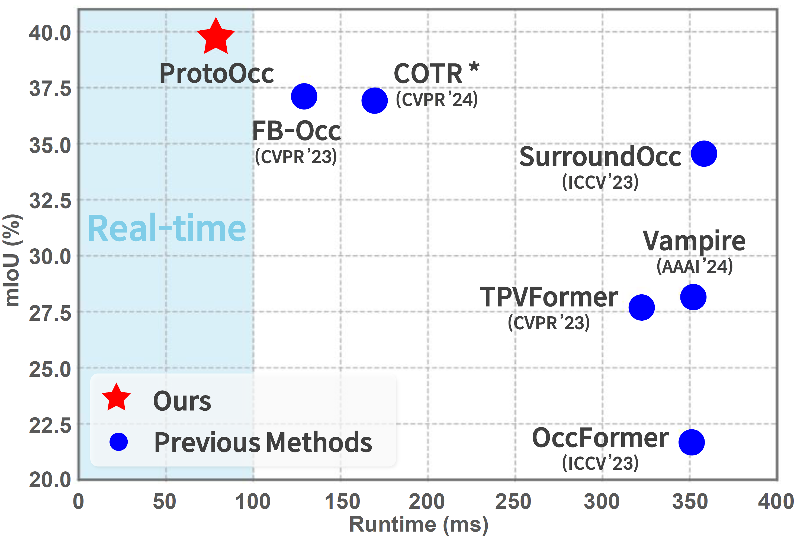
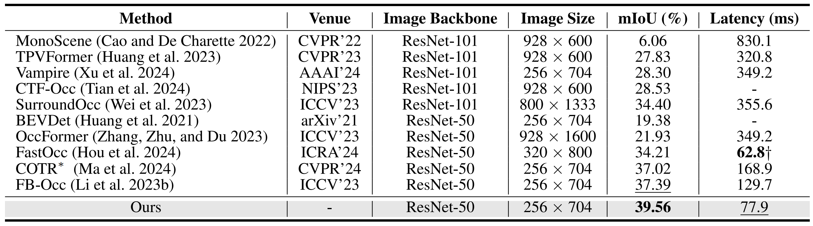
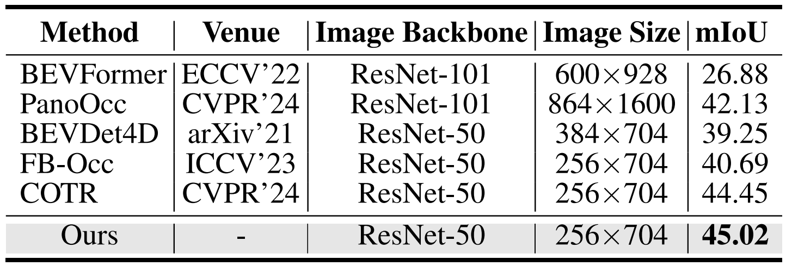

   
  
# ProtoOcc: Accurate, Efficient 3D Occupancy Prediction Using Dual Branch Encoder-Prototype Query Decoder

> **ProtoOcc: Accurate, Efficient 3D Occupancy Prediction Using Dual Branch Encoder-Prototype Query Decoder**, AAAI 2025.  
> Jungho Kim*, Changwon Kang*, Dongyoung Lee*, Sehwan Choi, Jun Won Choi†  
> *: Equal Contribution,  †: Corresponding Author

## News
- [2025/01]: We will release the code of ProtoOcc.
- [2024/12]: 🔥 ProtoOcc is accepted by AAAI 2025.
- [2024/08]: ProtoOcc achieves the SOTA on Occ3D-nuScenes with **45.02% mIoU** (Multi-frame) and **39.56% mIoU, 12.83 FPS** (Single-frame)!
 

## ProtoOcc
| |
|:--:| 
| **_Figure 1. Comparisons of the mIoU and runtime on the Occ3D-nuScenes validation set._**  The "\*" indicates results reproduced using public codes. Inference time is measured on a single NVIDIA RTX 3090 GPU. |

| |
|:--:| 
| **_Table 1. Comparison with single-frame methods on the Occ3D-nuScenes validation set._**  Latency is measured on a single NVIDIA RTX 3090 GPU. The "-" denotes that the associated results are not available. The "†" denotes that the latency was measured on an NVIDIA V100 GPU as reported in the paper. The "\*" indicates results reproduced using public code. |

| |
|:--:| 
| **_Table 2. Comparison with multi-frame methods on the Occ3D-nuScenes validation set._**  |

## Abstract
In this paper, we introduce ProtoOcc, a novel 3D occupancy prediction model designed to predict the occupancy states and semantic classes of 3D voxels through a deep semantic understanding of scenes. ProtoOcc consists of two main components: the Dual Branch Encoder (DBE) and the Prototype Query Decoder (PQD). The DBE produces a new 3D voxel representation by combining 3D voxel and BEV representations across multiple scales through a dual branch structure. This design enhances both performance and computational efficiency by providing a large receptive field for the BEV representation while maintaining a smaller receptive field for the voxel representation. The PQD introduces Prototype Queries to accelerate the decoding process. Scene-Adaptive Prototypes are derived from the 3D voxel features of input sample, while Scene-Agnostic Prototypes are computed by applying Scene-Adaptive Prototypes to an Exponential Moving Average during the training phase. By using these prototype-based queries for decoding, we can directly predict 3D occupancy in a single step, eliminating the need for iterative Transformer decoding. Additionally, we propose the Robust Prototype Learning, which injects noise into prototype generation process and trains the model to denoise during the training phase. ProtoOcc achieves state-of-the-art performance with 45.02% mIoU on the Occ3D-nuScenes benchmark. For single-frame method, it reaches 39.52% mIoU with an inference speed of 12.83 FPS on an NVIDIA RTX 3090.

