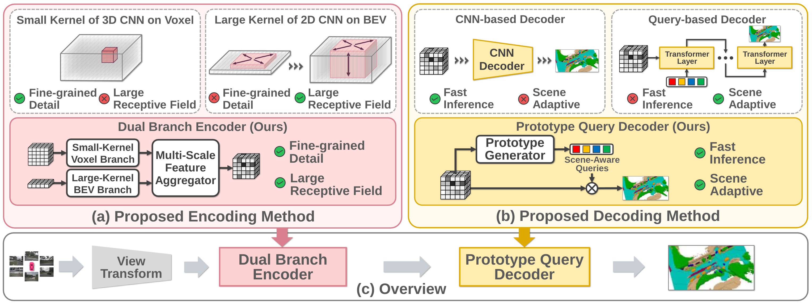

<div align="center">   
  
# ProtoOcc: Accurate, Efficient 3D Occupancy Prediction Using Dual Branch Encoder-Prototype Query Decoder

[**Jungho Kim***](https://scholar.google.com/citations?user=9wVmZ5kAAAAJ&hl=ko), **Changwon Kang***, **Dongyoung Lee***, [**Sehwan Choi**](https://scholar.google.com/citations?user=O2XSTY4AAAAJ&hl=ko&oi=ao), [**Jun Won Choi†**](https://scholar.google.com/citations?user=IHH2PyYAAAAJ&hl=ko&oi=ao)  
<sub>*: Equal Contribution,  †: Corresponding Author</sub>

### **AAAI 2025**

[](https://arxiv.org/abs/2412.08774)

</div>


## News
- [2025/07]: We released the full code & checkpoints of ProtoOcc, including **nuScenes (Single & Multi frame)** and **SemanticKITTI**.
- [2024/12]: ProtoOcc is accepted at AAAI 2025. 🔥
- [2024/08]: ProtoOcc achieves the SOTA on Occ3D-nuScenes with **45.02% mIoU** (Multi-frame) and **39.56% mIoU, 12.83 FPS** (Single-frame)!
</br>


## Demo


## 💡 Method
<p align="center">

</p>

**Overall structure of ProtoOcc.** **(a)** Dual Branch Encoder captures fine-grained 3D structures and models the large receptive fields in voxel and BEV domains, respectively. **(b)** The Prototype Query Decoder generates Scene-Aware Queries utilizing prototypes and achieves fast inference without iterative query decoding. **(c)** Our ProtoOcc framework integrates Dual Branch Encoder and Prototype Mask Decoder for 3D occupancy prediction.

## ⚡ Main Result
<p align="center">

</p>

### nuScenes Result
| Config                              | Temporal | Backbone | Input Size | Pooling Method | mIoU  | Google | Hugging | 
|:----------------------------------:|:-------------:|:--------:|:----------:|:----------:|:-----:|:-----:|:-----:|
| [ProtoOcc_1key](projects/configs/ProtoOcc/ProtoOcc_1key.py)                        |   1 Frame    |   R50    |  256x704   |   BEVDepth    | **39.56** |  [link](https://drive.google.com/file/d/1StxjW5rUXrsTvMKphkyxRfm6kWK-1f1N/view?usp=drive_link)     | [link](https://huggingface.co/junghokim/ProtoOcc/blob/main/ProtoOcc_1key.pth) |
| [ProtoOcc_longterm](projects/configs/ProtoOcc/ProtoOcc_longterm.py)                    |   8 Frames    |   R50    |  256x704   |   BEVStereo    | **45.02** |  [link](https://drive.google.com/file/d/1J-G1crZX4Xd3V_5XNRjUw4n4r9CnNvZ6/view?usp=drive_link)     |  [link](https://huggingface.co/junghokim/ProtoOcc/blob/main/ProtoOcc_longterm.pth) |

### Semantic-KITTI Result
| Config                              | Temporal | Backbone | Input Size | Pooling Method | mIoU  | Google |Hugging | 
|:----------------------------------:|:-------------:|:--------:|:----------:|:----------:|:-----:|:-----:|:-----:|
| [ProtoOcc_semanticKITTI](projects/configs/ProtoOcc/ProtoOcc_semanticKITTI.py)               |   1 Frame    |   R50    |  384x1280   |   BEVDepth    | **13.89** |  [link](https://drive.google.com/file/d/1qsNdCokN2JVA9bwQwFMK6X3fF58I8hqf/view?usp=drive_link)    |  [link](https://huggingface.co/junghokim/ProtoOcc/blob/main/ProtoOcc_semanticKITTI.pth) |

## Training & Evaluation
- ### [Environment Setup](doc/install.md)

### Training
We trained all models using four RTX 3090 (24GB) GPUs.
```
CONFIG=ProtoOcc_1key # (ProtoOcc_1key / ProtoOcc_longterm / ProtoOcc_semanticKITTI)

./tools/dist_train.sh projects/configs/ProtoOcc/${CONFIG}.py 4 --work-dir ./work_dirs/${CONFIG}
```

### Evaluation
If you want to get the pretrained weights, download them from [Google Drive](https://drive.google.com/drive/folders/1-hHITEyUVnbEHaI80u6C6ZiUmdXLoFjy?usp=drive_link) or [Hugging Face](https://huggingface.co/junghokim/ProtoOcc/tree/main).  
To measure inference speed, uncomment `# fp16 = dict(loss_scale='dynamic')` in the config file.  
```
CONFIG=ProtoOcc_1key # (ProtoOcc_1key / ProtoOcc_longterm / ProtoOcc_semanticKITTI)

bash tools/dist_test.sh ./projects/configs/${CONFIG}.py ./work_dirs/${CONFIG}/${CONFIG}.pth 1 --eval bboxx
```

## 🙏 Acknowledgement

This project builds upon several outstanding open-source projects. We gratefully acknowledge the following key contributions.

- [open-mmlab](https://github.com/open-mmlab), [DN-DETR](https://github.com/IDEA-Research/DN-DETR), [Occ3D](https://github.com/Tsinghua-MARS-Lab/Occ3D), [BEVDet](https://github.com/HuangJunJie2017/BEVDet), [OccFormer](https://github.com/zhangyp15/OccFormer), [FB-OCC](https://github.com/NVlabs/FB-BEV), [FlashOCC](https://github.com/Yzichen/FlashOCC), [COTR](https://github.com/NotACracker/COTR)

## 📃 Bibtex

If you find this work useful for your research or projects, please consider citing the following BibTeX entry.

```
@inproceedings{kim2025protoocc,
  title={Protoocc: Accurate, efficient 3d occupancy prediction using dual branch encoder-prototype query decoder},
  author={Kim, Jungho and Kang, Changwon and Lee, Dongyoung and Choi, Sehwan and Choi, Jun Won},
  booktitle={Proceedings of the AAAI Conference on Artificial Intelligence},
  volume={39},
  number={4},
  pages={4284--4292},
  year={2025}
}
```

